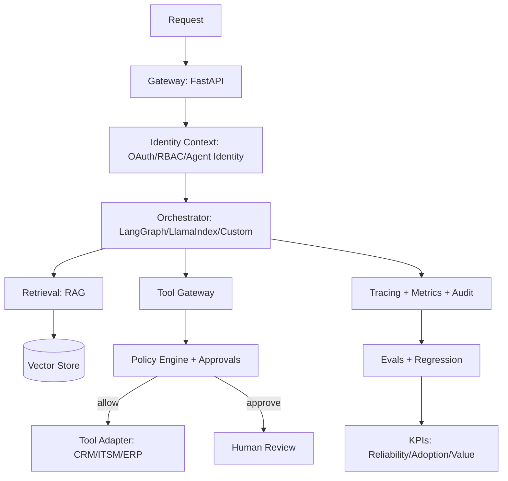
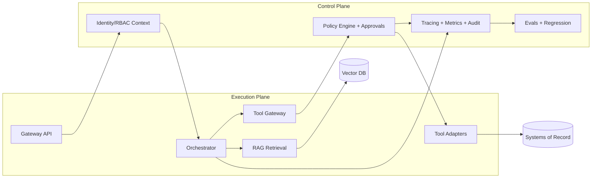

# Production-Grade AI Agents as an Engineering and Governance Discipline

## Executive summary

AI agents are crossing a threshold: they are increasingly expected to **take actions inside real systems** (tools, APIs, data platforms, workflows), not merely generate text. The production bottleneck is no longer “model cleverness,” but **operational trust** - the ability to prove that an agent is reliable, permissioned, auditable, monitored, and constrained to safe autonomy. This shift shows up clearly in guidance and product direction from NIST (risk management frameworks and a generative AI risk profile), Microsoft (enterprise “control-plane” framing for agents and identity/governance emphasis), Google Cloud (agent KPI frameworks focused on reliability, adoption, and business value), OpenAI (tracing, evals, tool-calling discipline, and agent safety guidance), and Anthropic (agent eval methodologies and research emphasizing tool-call analysis and evaluation rigor).

This report transforms the seed topic - **“How to make AI agents reliable, governable, and safe enough for real production use”** - into two publishable assets that position you as a senior AI/ML engineer and strategic consultant:

- A LinkedIn-ready article draft that argues the “control plane” is the new differentiator and explains how to build it.
- A GitHub README / portfolio essay draft that presents a concrete, defensible architecture, implementation plan, eval checklist, KPIs, and security posture.

Your experience context from this conversation (RAG/LLMOps, identity, data-platform architecture/system design, integration work, and career goals) is used as positioning scaffolding - without inventing specific projects, metrics, or employers. Where personal details would normally strengthen credibility, the drafts explicitly mark them as **unspecified placeholders**.

## Research findings that shape the article and README

### Why this matters now

A recurring theme across official sources is that “agentic” systems create value by moving beyond single-turn assistance into **multi-step work that unfolds over time**, often across multiple applications and tools. This increases capability - and the blast radius of failures - because agents can write data, trigger workflows, and compound mistakes across steps.

Enterprise vendors are explicitly reframing agents as something that must be **observed, governed, and secured at scale** - a control-plane problem, not just “prompting.” Microsoft’s recent announcements and security guidance describe an agent control-plane concept (observe, govern, manage, secure) and emphasize that trust and governance are prerequisites for scaling agentic deployments.

Google Cloud’s KPI guidance is aligned: it argues LLM metrics like perplexity/BLEU or simple thumbs feedback are insufficient for autonomous agents, and proposes measuring agents through **three pillars**: reliability & operational efficiency, adoption & usage, and business value. It also stresses that for multi-step workflows, you must evaluate the **trajectory** (the sequence of thoughts/actions), not just the final answer.

### What business problems this solves

The business case for production agents is not “better text.” It is **workflow automation** (or at least workflow acceleration) with measurable outcomes - resolution time, pipeline velocity, cash collection, documentation currency, and other operational KPIs that the business already understands. Microsoft’s “leaders” framing highlights that scaling agents means managing hundreds or thousands of processes and that the differentiator becomes governance plus measurement, not “who has the most agents.”

### What technical problems this solves

The technical problem is converting non-deterministic model behavior into **predictable system behavior**. Across sources, the repeatable pillars are:

- **Evaluation discipline**: Anthropic argues that without good evals teams enter reactive loops - finding failures only in production and “fixing one failure creates others.”
- **Tool-calling rigor**: OpenAI’s function/tool calling model is explicitly a multi-step exchange controlled by your application, making the app-side enforcement layer central to safety and reliability.
- **Tracing and observability**: OpenAI highlights tracing/evals as first-class features for evaluating agent performance, and its agent-building guidance ties “understand what models are doing” to trace graders and evals.
- **Risk management and governance**: NIST’s AI RMF defines four functions - Govern, Map, Measure, Manage - and makes governance cross-cutting. Its Generative AI Profile extends that lens with genAI-specific risks and recommended actions (including governance, provenance, pre-deployment testing, incident disclosure).

### Risks if done poorly

NIST’s Generative AI Profile explicitly catalogs risk areas such as confabulation (hallucination), data privacy, information integrity, information security, and value chain/component integration, and notes that some genAI risks can be unknown or hard to estimate.

OpenAI’s agent safety guidance calls out prompt injection and malicious tool use risks and recommends keeping tool approvals enabled, using input guardrails, and preventing untrusted data from directly driving tool execution (prefer validated structured fields).

Microsoft’s enterprise framing warns that as agents scale, complexity arrives fast and organizations lose track of “what is running and why” without visibility; that loss of visibility is a governance and operational risk.

### Hiring-manager relevance

The implication for hiring is straightforward: senior AI/ML roles increasingly reward candidates who treat agents as **systems** - with identity, policy, telemetry, evaluation, and operational KPIs.

To demonstrate “senior” competence, the artifacts should show the ability to:
- design the architecture (control plane + execution plane),
- implement a safe tool gateway and evaluation flywheel,
- integrate identity and least privilege,
- measure reliability and business outcomes with concrete KPIs.

## Production blueprint for reliable, governable, safe agents

### A control-plane mental model aligned to primary sources

A unifying synthesis of the primary sources is: **production agents require a control plane**. That is, a layer that enforces identity, authorization, approvals, logging, evaluation, and rollbacks - separate from the agent’s reasoning loop.

This aligns cleanly with:
- NIST’s notion that “Govern” is cross-cutting and infused throughout the lifecycle.
- Microsoft’s “control-plane for AI agents” framing (observe, govern, manage, secure).
- Google Cloud’s insistence that measurement of agent trajectories and KPIs is essential to move beyond “handled 10,000 tasks” into “how many were right.”
- OpenAI’s guidance that approvals, guardrails, and trace graders/evals reduce prompt injection and malicious tool use, and that tool calling is executed on the application side.

### Architecture flowchart in Mermaid

```mermaid
flowchart TD
 U[User / System Trigger] --> GW[API Gateway (FastAPI)]
 GW --> AUTH[AuthN/AuthZ Context]
 AUTH --> ORCH[Agent Orchestrator (LangGraph/LlamaIndex/Custom)]
 ORCH -->|retrieve| RET[Retrieval Layer (RAG)]
 RET --> VDB[(Vector Store: pgvector / Pinecone / FAISS / Databricks VS)]
 ORCH -->|propose tool call| TG[Tool Gateway]
 TG --> PE[Policy Engine: RBAC + Risk Tiers + Approvals]
 PE -->|allow| TOOL[Tool Adapters (CRM/ITSM/ERP/DB)]
 PE -->|approve required| HIL[Human-in-the-Loop Approval]
 TOOL --> SYS[(Systems of Record)]
 ORCH --> OBS[Tracing + Metrics + Logs]
 OBS --> EVAL[Offline/Online Evals + Regression Suite]
 OBS --> AUDIT[Audit/SIEM Stream]
 EVAL --> KPI[Dashboards: Reliability / Adoption / Business Value]
 AUDIT --> KPI
```

The architecture diagram is intentionally “control-plane forward”: the tool gateway + policy engine are first-class components, because the app-side tool execution loop is where safety and governance are enforceable.

### Tooling choices and tradeoffs

#### Model backends

| Option | Why teams choose it | Typical “control plane” implications | When it’s a poor fit |
|---|---|---|---|
| OpenAI API | Strong agent building primitives (tools, tracing, evals guidance) and explicit tool-calling flow controlled by your app. | Easy to standardize on trace + eval loops; still requires external identity/policy gates for enterprise tool access. | If policy/data residency constraints require fully private hosting (unless mitigated by other architecture choices). |
| Azure OpenAI | Enterprise-friendly identity patterns via managed identities and Entra auth; avoids storing credentials in apps by using managed identities. | Enables keyless auth and aligns agent access with cloud IAM/RBAC patterns. | If you need multi-cloud portability and want to avoid Azure platform coupling. |
| Amazon Bedrock | Platform guardrails (content filters, sensitive info filters, “prompt attack” category, contextual grounding checks). | Guardrails become a standardized control layer for input/output filtering; you still need scope-based permissions and approvals in your tool gateway. | If your team needs maximum model-specific control or non-AWS infrastructure. |
| Ollama | Local inference for prototyping or constrained environments (security/privacy-driven). (General industry practice; no single authoritative source in this set.) | Requires you to build more of the safety/telemetry stack yourself; still compatible with the same control-plane concepts. | If you need managed enterprise SLAs or highest frontier capability. |

#### Vector stores and governed retrieval

| Option | Why teams choose it | Key governance consideration | Notable “gotchas” |
|---|---|---|---|
| pgvector | Keeps vectors in Postgres “with the rest of your data,” supports exact/ANN search. | Access control often piggybacks on existing DB permissions, but you must still validate per-user/role filtering is enforced for RAG. | Scaling + indexing strategy becomes your ops responsibility. |
| Pinecone | Managed vector database with production features and clear guidance for filtering at scale. | Filtering for access control can fail at scale if implemented as giant `$in` lists; Pinecone explicitly recommends namespace-based isolation or group-based filtering. | Tenancy model design is required early - retrofit is painful. |
| FAISS | Local similarity search library supporting very large sets and evaluation/tuning utilities. | Governance and access control are entirely your responsibility (because it’s a library, not a governed service). | Persistence, multi-tenancy, and auditability require extra engineering. |
| Databricks Vector Search | Indexes “appear in and are governed by Unity Catalog” for data governance integration. | Governance can align with existing lakehouse policy and catalog controls, which is valuable for enterprise RAG. | Requires Unity Catalog/serverless prerequisites and Databricks platform alignment. |

#### Observability and evaluation platforms

A production agent requires observability because agentic workflows are multi-step and non-deterministic; OpenAI’s guidance ties safety to trace graders/evals, Anthropic emphasizes eval-driven development to avoid reactive loops, and Google frames evaluation as trajectory analysis plus KPIs.

Common choices for instrumentation and evaluation include:
- OpenAI’s tracing/evals tooling (platform-native) for OpenAI-based stacks.
- OpenTelemetry as a vendor-neutral correlation layer for traces/metrics/logs.
- LLM-focused tracing/eval tools (Langfuse, W&B Weave, MLflow evaluation/tracing).

### Implementation patterns that “look like production”

The patterns below are strongly supported by primary sources, even when phrased differently:

- **Eval-first or eval-driven development**: treat failures as test cases; build regression suites as you iterate.
- **Trajectory-aware evaluation**: grade tool selection, step ordering, and safety - not just final answer correctness.
- **Tool gateway + explicit approvals**: keep approvals on for tools (reads/writes) and validate structured fields from untrusted inputs to reduce injection risk.
- **Tool definitions are product quality**: tool docstrings, parameter clarity, edge cases, and “poka‑yoke” (make wrong usage harder) improve reliability.
- **Identity-integrated keyless auth** where possible (managed identities) to avoid embedded credentials for enterprise model endpoints.
- **Operational KPIs** that connect technical metrics to business outcomes (reliability, adoption, value).

## LinkedIn-ready article draft

**Note on personal experience separation (required by your prompt):**

- **Directly built/designed (unspecified where missing):** You have stated RAG/LLMOps + identity + data-platform + architecture/system-design experience; specific systems, employers, scale, and outcomes are **unspecified** in this conversation.
- **Strategic contributions (unspecified where missing):** You have stated architecture/system design and integration work; specific scope and stakeholder outcomes are **unspecified**.
- **Industry best practices:** Everything technical below is grounded in the cited sources and widely used engineering patterns.

### Title options (pick one)

1) The Real Bottleneck in AI Agents Isn’t Intelligence - It’s Operational Trust
2) From Demo Agents to Production Agents: The Control Plane Is the Product
3) Reliable AI Agents Require Governance, Evals, and a Tool Gateway - Not Just Prompts
4) The Production Checklist for AI Agents: Identity, Policy, Evaluation, Observability
5) Why “Agentic AI” Forces a New Discipline: AgentOps + Governance by Design

### Executive summary

AI agents are shifting from “helpful chat” to **tool-using systems that take actions inside workflows**. That shift moves the hard work from model selection to system design: evaluation, observability, identity, governance, and controlled autonomy become the limiting factor. Across NIST, Microsoft, Google, OpenAI, and Anthropic, the message converges: production agents require a control plane that makes behavior measurable, permissioned, auditable, and safe.

### Hook

Most “AI agent” demos accidentally hide the hardest parts: permissions, telemetry, evals, and safe tool execution. The moment an agent can read internal data or trigger actions, you don’t just need a smarter model - you need a **system you can trust under audit and under failure**.

### Problem statement

An AI agent is a multi-step system that calls tools, modifies state, and adapts based on intermediate results - exactly the properties that make it valuable and simultaneously harder to evaluate and govern. If you “ship the loop” without a control plane, you inherit failure modes that don’t look like normal bugs: silent regressions, unsafe tool use, permission leakage, and hard-to-reproduce multi-step failures.

### Why this matters now

- Microsoft describes agentic work as long-running, multi-step execution that unfolds over time, is observable, and must operate within security/identity/governance frameworks to scale safely.
- Google Cloud argues that classic LLM metrics don’t measure autonomous agents, and proposes a KPI framework organized around reliability, adoption, and business value - explicitly noting that trajectory evaluation is required for multi-step workflows.
- NIST’s AI RMF and Generative AI Profile provide the backbone: govern/map/measure/manage, and a catalog of genAI-specific risk areas like confabulation, data privacy, information integrity, and information security.
- OpenAI and Anthropic emphasize that evals and monitoring are how teams ship agents confidently and avoid “production-only” discovery of failures.

### The core technical idea: separate the execution plane from the control plane

Production agents need two planes:

**Execution plane**
The agent loop: retrieve context, decide steps, call tools, synthesize response.

**Control plane**
Identity, authorization, approvals, policy, logging, tracing, evaluation, and rollback controls - ideally enforceable outside the model prompt.

This framing matches how NIST treats governance as cross-cutting, and how Microsoft frames the need to “observe, govern, manage and secure agents.”

### Architecture diagram (Mermaid)



### Tools & frameworks and why they matter

This is the concrete stack I look for when evaluating “production readiness”:

- **Python + FastAPI** for a controllable agent gateway and tool gateway (typed schemas, middleware, auth context).
- **Agent orchestration** (LangChain/LangGraph or LlamaIndex or custom) because stateful, multi-step control is an engineering problem, not a prompt. Google’s point about trajectories pushes you toward explicit orchestration.
- **Tool calling discipline**: OpenAI documents tool-calling as a multi-step loop where your application executes the tool and then returns results. That makes app-side validation and policy enforcement non-negotiable.
- **Vector retrieval** (pgvector / Pinecone / FAISS / Databricks Vector Search) to ground outputs. But retrieval is not governance; access control must be enforced upstream (identity + filtering + policy). The vector store choice affects how cleanly you can enforce per-tenant/per-role policies.
- **Tracing + eval tooling**: OpenAI highlights tracing and evaluations as core for agent performance; its safety guidance recommends trace graders and evals. Anthropic argues evals prevent reactive loops.
- **Identity, not keys** (where possible): Azure OpenAI explicitly supports Entra authentication with managed identities, reducing credential sprawl.
- **Guardrails as layered controls**: Bedrock’s guardrails enumerate concrete categories like “Prompt Attack,” sensitive information filters, and contextual grounding checks to catch hallucinations against sources. Even if you don’t use Bedrock, the control taxonomy is useful.

### Step-by-step implementation (beginner → production)

**Beginner (single loop, low risk)**
- Single agent answers questions with retrieval grounding (RAG) from a curated corpus.
- No write actions.
- Basic logging of requests, retrieval hits, and outputs.
- A small offline eval set to catch obvious regressions.

**Intermediate (tool use, bounded writes)**
- Add a tool gateway that supports read tools + “draft action” tools (e.g., draft an ITSM ticket) but still requires humans to execute.
- Implement approvals; OpenAI explicitly recommends keeping tool approvals on, including reads/writes for MCP tools.
- Start trajectory evals: tool selection correctness, step ordering, and outcome success.
- Add tracing across each step for debugging and auditing.

**Production-grade (enterprise safe autonomy)**
- Identity-integrated agent identities + RBAC scopes.
- Policy engine with risk tiers (low/medium/high) and action classes (read/draft/write/destructive).
- Approval workflows for high-risk actions.
- Continuous evaluation in CI + scheduled evals + online monitoring tied to business KPIs.
- Incident response and disclosure readiness (explicitly emphasized as a primary consideration in NIST’s generative profile focus areas).

### Sample project structure

```text
agent-control-plane/
 app/
 main.py # FastAPI entrypoint
 auth/ # OAuth/JWT middleware, agent identity context
 orchestration/ # agent loop, state machine/graph, routing
 retrieval/ # chunking, embeddings, vector queries, reranking
 tools/ # tool adapters (CRM/ITSM/ERP/DB), typed schemas
 policy/ # risk tiers, RBAC rules, approvals
 observability/ # tracing, audit logs, metrics
 evals/ # offline eval suite, regression harness, graders
 infra/
 docker/
 k8s/
 ci/
 docs/
 threat-model.md
 eval-metrics.md
 runbooks.md
```

### Code snippet (policy gate for tool calls)

```python
from dataclasses import dataclass
from enum import Enum

class ActionType(str, Enum):
 READ = "read"
 DRAFT = "draft"
 WRITE = "write"
 DESTRUCTIVE = "destructive"

class RiskTier(str, Enum):
 LOW = "low"
 MEDIUM = "medium"
 HIGH = "high"

@dataclass(frozen=True)
class ToolCallIntent:
 tool: str
 action: ActionType
 risk: RiskTier
 confidence: float # model confidence or heuristic score

def decide(intent: ToolCallIntent) -> dict:
 # hard blocks
 if intent.action == ActionType.DESTRUCTIVE:
 return {"decision": "deny", "reason": "destructive actions disabled"}

 # approvals for high-risk writes
 if intent.risk == RiskTier.HIGH and intent.action in {ActionType.WRITE}:
 return {"decision": "approval_required", "reason": "high-risk write"}

 # escalate low-confidence actions
 if intent.action in {ActionType.WRITE} and intent.confidence < 0.80:
 return {"decision": "escalate", "reason": "low confidence write intent"}

 return {"decision": "allow", "reason": "within policy"}
```

### Evaluation checklist (what “good” looks like)

This checklist is derived from the overlapping themes in OpenAI eval guidance, Anthropic agent eval guidance, and Google’s trajectory/KPI framing:

- Define objectives and success criteria per workflow (not “the agent is good”).
- Build datasets from representative tasks (synthetic + real logs where allowed).
- Evaluate both **outcomes** and **trajectories** (tool choice, step order, error recovery).
- Include security tests: prompt injection attempts, unsafe tool use attempts, untrusted text driving tool calls (should be blocked or forced into structured fields).
- Use tracing so every failure is reproducible and debuggable.
- Treat infra as part of measurement: Anthropic shows infrastructure configuration can swing agentic eval results by multiple percentage points, sometimes exceeding leaderboard gaps.

### Production KPIs (adapted from Google Cloud’s three pillars)

| Pillar | KPI examples | Why it matters |
|---|---|---|
| Reliability & operational efficiency | Task completion rate; trajectory correctness; tool-call success rate; mean retries; cost per successful task; latency P50/P95. | Reliability is about consistently completing workflows cost-effectively, not occasional success. |
| Adoption & usage | Active users; repeat usage; proactive vs reactive agent invocation; abandonment and escalation rates. | Adoption reveals whether the agent fits workflows and reduces friction. |
| Business value | Resolution time reduction; pipeline velocity; cash collection improvements; documentation freshness/coverage where applicable. | Value must tie to existing business metrics, not vanity metrics. |

### How this positions me (explicitly separated)

**What I built/designed (unspecified):**
I have experience in RAG/LLMOps and in identity/data-platform system design and integrations. Specific shipped systems, scale, latency, cost, or governance outcomes are **unspecified** here.

**What I contributed strategically (unspecified):**
I’ve done architecture/system-design work that connects AI delivery with identity, governance, and enterprise integration. Specific programs and stakeholder impacts are **unspecified**.

**Industry best practices (grounded):**
The control-plane framing, eval-driven development, trajectory evaluation, tool-approval gating, and risk-management lens are directly supported by NIST, Microsoft, Google Cloud, OpenAI, and Anthropic.

### Interview prompts this article prepares you for (10)

1) How do you separate “agent execution” from “agent governance”?
2) How do you evaluate a multi-step agent beyond final-answer accuracy?
3) How do you prevent prompt injection from causing unsafe tool calls?
4) Why do you need tracing in production agents?
5) How do you decide when to require human approval?
6) How do you design tool interfaces so models use them correctly?
7) How do you enforce identity and least privilege for agents?
8) What KPIs prove an agent is producing real business value?
9) How do you handle non-determinism and regressions?
10) What risks does NIST highlight for generative AI systems that matter for agents?

### Sources to include when posting (copy/paste)

```text
NIST AI RMF 1.0 (NIST AI 100-1): https://nvlpubs.nist.gov/nistpubs/ai/nist.ai.100-1.pdf
NIST Generative AI Profile (NIST AI 600-1): https://nvlpubs.nist.gov/nistpubs/ai/NIST.AI.600-1.pdf
Microsoft: Powering Frontier Transformation with Copilot and agents (2026-03-09): https://www.microsoft.com/en-us/microsoft-365/blog/2026/03/09/powering-frontier-transformation-with-copilot-and-agents/
Microsoft Security: Secure agentic AI for your Frontier Transformation (2026-03-09): https://www.microsoft.com/en-us/security/blog/2026/03/09/secure-agentic-ai-for-your-frontier-transformation/
Google Cloud: The KPIs that actually matter for production AI agents (2026-02-26): https://cloud.google.com/transform/the-kpis-that-actually-matter-for-production-ai-agents
Anthropic: Demystifying evals for AI agents (2026-01-09): https://www.anthropic.com/engineering/demystifying-evals-for-ai-agents
OpenAI: Function calling / tool calling flow: https://developers.openai.com/api/docs/guides/function-calling/
OpenAI: Evaluation best practices: https://developers.openai.com/api/docs/guides/evaluation-best-practices/
OpenAI: Safety in building agents: https://developers.openai.com/api/docs/guides/agent-builder-safety/
```

## GitHub README / portfolio essay draft

**Purpose of this README:** a portfolio-grade, engineer-readable blueprint that demonstrates senior-level thinking: architecture, tradeoffs, risk controls, eval strategy, and measurable KPIs - without claiming undisclosed production experience. It is written so you can drop it into a repo as-is, then replace placeholders with your real project details.

### README title

**Agent Control Plane: Building Reliable, Governable, Safe AI Agents for Production**

### Executive summary

This portfolio project describes an end-to-end architecture for deploying AI agents that can retrieve enterprise knowledge (RAG), call tools safely, and operate under identity-aware permissions with continuous evaluation and observability. The design is aligned to:

- NIST’s AI Risk Management Framework (Govern/Map/Measure/Manage) and its Generative AI Profile risk categories.
- Microsoft’s enterprise framing that agent deployments require observability, governance, and security controls at scale.
- Google Cloud’s KPI approach that prioritizes reliability, adoption, and business value, and requires trajectory evaluation for multi-step agents.
- OpenAI and Anthropic guidance emphasizing eval-driven development, tracing, tool approvals, and safe handling of untrusted inputs.

**Personal experience note (required):** I have experience in RAG/LLMOps, identity, data-platform architecture, and system design. Specific projects, employers, and production metrics are intentionally **unspecified** in this public draft.

### Hook

If an agent can take actions, the question is not “can it answer?” The question is:

- What is it allowed to do?
- How do we prove it did the right thing?
- How do we stop it when it doesn’t?

### Problem statement

Agents operate over many turns, call tools, and modify external state. Those properties increase value and also increase evaluation difficulty - making it easy to get stuck in “production-only debugging.” This repo treats evals, tracing, and policy gating as first-class product requirements.

### Architecture



**Design rationale:** tool calling is a multi-step flow where the application executes the tool and returns results. That makes the tool gateway the natural enforcement point for policy, approvals, and audit.

### Tool stack (swap based on your environment)

**Core implementation**
- Python + FastAPI (API gateway + tool gateway)
- Orchestrator: LangGraph / LlamaIndex / custom state machine
- Storage: Postgres + Redis
- Vector store: pgvector / Pinecone / FAISS / Databricks Vector Search
- Observability: OpenTelemetry + (Langfuse / W&B Weave / MLflow)
- CI/CD + scheduled evals: GitHub Actions + (Airflow / Prefect)

**Identity options**
- Entra-managed identity patterns for Azure OpenAI endpoints to reduce credential sprawl.
- Agent identity governance patterns if operating in Microsoft ecosystems.

### Step-by-step implementation plan (beginner → production)

**Stage A: RAG assistant (read-only)**
- Build ingestion: chunking + embeddings + vector index
- Build retrieval: top-k + reranking + citation stitching
- Build baseline evals: correctness, groundedness, failure rate (offline)
- Add tracing for each step (retrieval, prompt, output)

**Stage B: Tool-using agent (bounded)**
- Add tool gateway
- Start with “read tools” and “draft tools”
- Keep tool approvals on; require confirmed ops for reads/writes when tools reach sensitive systems.
- Add trajectory evals: correct tool selection, correct arguments, correct step ordering.

**Stage C: Governed autonomy**
- Add risk tiers (low/med/high) and action classes (read/draft/write/destructive)
- Require approval for high-risk writes
- Add continuous regression tests in CI and scheduled production evals
- Deploy KPI dashboards under the Google Cloud pillar model: reliability, adoption, business value.

### Sample repo structure

```text
.
├── app/
│ ├── main.py
│ ├── gateway/
│ ├── orchestration/
│ ├── retrieval/
│ ├── tools/
│ ├── policy/
│ ├── observability/
│ └── evals/
├── infra/
│ ├── docker/
│ ├── k8s/
│ └── ci_cd/
├── datasets/
│ ├── eval_tasks.jsonl
│ └── redteam_prompts.jsonl
└── docs/
 ├── architecture.md
 ├── threat_model.md
 ├── eval_strategy.md
 └── runbooks.md
```

### Minimal code snippet: safe tool execution contract

```python
from pydantic import BaseModel, Field

class CreateTicketInput(BaseModel):
 title: str = Field(min_length=8, max_length=120)
 description: str = Field(min_length=20, max_length=4000)
 severity: str = Field(pattern="^(low|medium|high)$")
 customer_id: str = Field(pattern="^[A-Z0-9_-]{6,32}$")

def create_ticket_tool(payload: CreateTicketInput, auth_context: dict) -> dict:
 """
 Tool adapter: validates structured input and uses auth_context scopes.
 Do not allow raw untrusted text to directly form tool arguments.
 """
 # enforce RBAC scopes here (pseudo)
 if "tickets:write" not in auth_context.get("scopes", []):
 raise PermissionError("Missing scope: tickets:write")

 # execute side effect (pseudo)
 ticket_id = "TCK-12345"
 return {"ticket_id": ticket_id, "status": "created"}
```

This follows OpenAI’s guidance: untrusted data should not directly drive agent behavior; extract validated structured fields and enforce approvals/permissions at the gateway.

### Evaluation checklist (portfolio-grade)

This checklist is intentionally aligned to NIST’s “measure/manage,” Anthropic’s eval discipline, OpenAI’s eval best practices, and Google’s trajectory emphasis:

- Objective defined per workflow (success criteria + failure modes).
- Dataset created from representative tasks (including corner cases).
- Outcome grading: correctness, groundedness, safety compliance.
- Trajectory grading: tool selection, argument validity, step ordering, error recovery.
- Security evals: prompt injection attempts; attempts to smuggle tool arguments via untrusted text; ensure structured extraction blocks unsafe flows.
- Observability baseline: trace IDs, tool call logs, retrieval citations, latency/cost metrics.
- Measurement hygiene: infra config can change eval results; treat infra as part of the experimental variable.

### KPI dashboard template (production KPIs)

Use Google Cloud’s three pillars as the organizing frame:

- Reliability & operational efficiency: task completion rate, trajectory success rate, retries, P95 latency, cost per successful workflow.
- Adoption & usage: active users, proactive vs reactive invocations, escalation rates, abandonment.
- Business value: resolution time, pipeline velocity, cash collection, documentation freshness (depending on domain).

### Common mistakes (and what “good” looks like)

**Mistake: output-only evaluation**
Good: evaluate trajectories and tool decisions, not only final answers.

**Mistake: “governance in the prompt”**
Good: enforce policy at the tool gateway with approvals and identity scopes (prompt constraints are advisory; the gateway is enforceable).

**Mistake: ignoring drift and non-determinism**
Good: follow evaluation best practices - define objectives, build datasets, re-run and compare evals continuously.

**Mistake: treating infra as irrelevant to evals**
Good: version and control infra settings; Anthropic shows infra alone can move agentic benchmark results by multiple percentage points.

### Sources section (copy/paste)

```text
NIST AI RMF 1.0 (AI 100-1): https://nvlpubs.nist.gov/nistpubs/ai/nist.ai.100-1.pdf
NIST Generative AI Profile (AI 600-1): https://nvlpubs.nist.gov/nistpubs/ai/NIST.AI.600-1.pdf
Google Cloud KPI framework for production agents: https://cloud.google.com/transform/the-kpis-that-actually-matter-for-production-ai-agents
Anthropic evals for agents: https://www.anthropic.com/engineering/demystifying-evals-for-ai-agents
OpenAI evaluation best practices: https://developers.openai.com/api/docs/guides/evaluation-best-practices/
OpenAI function/tool calling flow: https://developers.openai.com/api/docs/guides/function-calling/
OpenAI safety in building agents: https://developers.openai.com/api/docs/guides/agent-builder-safety/
```

## Career translation pack

### Three LinkedIn captions to promote the article

1) AI agents aren’t blocked by intelligence anymore - they’re blocked by trust. This post breaks down what it takes to ship agents that are reliable, governed, and safe enough for real production workflows: evals, tracing, identity, approvals, and measurable KPIs.

2) If your agent can call tools, the “app-side” architecture matters more than your prompt. I wrote a deep dive on the control plane needed to keep autonomy safe: policy gates, approvals, auditability, and trajectory-based evaluation.

3) Most teams can demo an agent. Fewer teams can operate one. Here’s a production blueprint grounded in NIST risk management, trajectory KPIs, and practical guardrails - designed for the enterprise reality of identity, data governance, and audit.

### Five resume bullets inspired by this topic (fill in metrics where you have them)

1) Architected a production agent-control-plane pattern integrating retrieval grounding (RAG), policy-gated tool execution, and trace-driven evaluation loops to improve reliability and auditability.
2) Designed identity-aware AI workflows using enterprise IAM principles (OAuth/RBAC/managed identities), minimizing credential sprawl and enabling least-privilege access.
3) Implemented evaluation-driven development for agentic systems, including regression suites that score trajectory correctness (tool selection, step ordering) rather than output-only correctness.
4) Built observability foundations for multi-step AI workflows (tracing, audit logging, KPI dashboards) to support incident response, governance, and continuous improvement.
5) Translated agent reliability and governance into executive-facing KPIs (reliability, adoption, business value) aligned to measurable operational outcomes.

### Ten follow-on article ideas (each with why it matters and what it connects to)

1) Trajectory-based evaluation is the new unit test
Why: output-only metrics fail for multi-step agents.
Connects to: eval harnesses, tracing, CI/CD.

2) Retrieval isn’t governance
Why: grounded answers can still be unauthorized answers.
Connects to: RBAC, filtering design, tenancy models.

3) Designing tool gateways that survive prompt injection
Why: OpenAI explicitly warns about untrusted data driving tool calls and recommends structured isolation.
Connects to: schema validation, approvals, sandboxing.

4) The “control plane” pattern for enterprise agents
Why: Microsoft is explicitly productizing agent governance/observability at scale.
Connects to: identity governance, audit, security operations.

5) KPI frameworks that prove business value of agents
Why: Google’s KPI model forces measurement discipline beyond “activity.”
Connects to: product analytics, org adoption, ROI.

6) Why infra belongs in the eval spec
Why: Anthropic shows infra alone can swing agentic eval results - measurement must control for it.
Connects to: reproducibility, benchmarking, procurement.

7) Risk mapping for agent systems using NIST AI RMF + GenAI Profile
Why: NIST provides risk categories and a lifecycle lens.
Connects to: governance, incident disclosure, provenance.

8) Choosing a vector store for secured RAG and multi-tenant access control
Why: filtering and tenancy design can break at scale; vendors provide explicit guidance.
Connects to: data governance, ABAC/RBAC, performance.

9) Human-in-the-loop without killing ROI
Why: approvals must be risk-tiered and placed where they matter.
Connects to: workflow design, escalation policies, audit.

10) Monitoring “why the agent acted,” not just “what it output”
Why: safety guidance and monitorability research argue that internal decision signals matter for supervision. 
